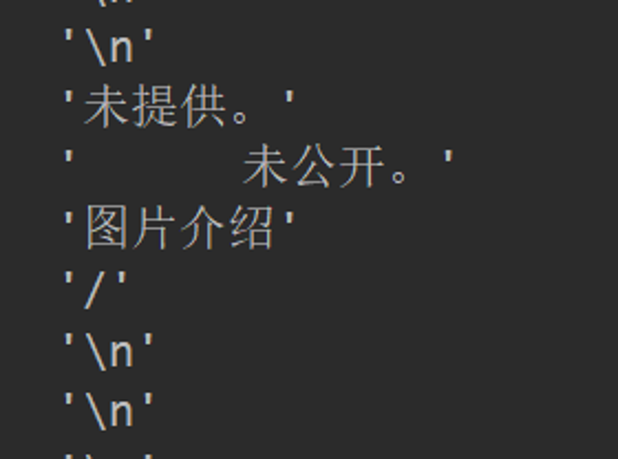
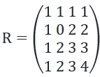
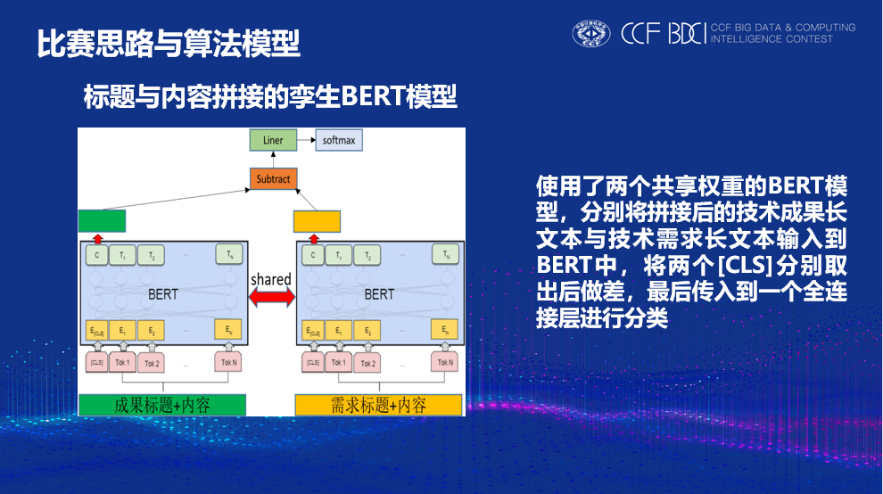
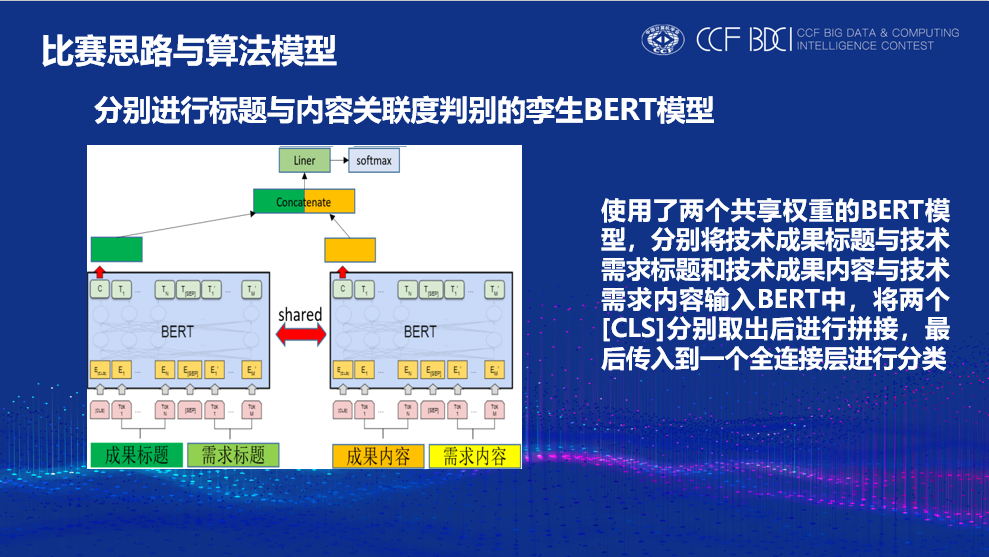
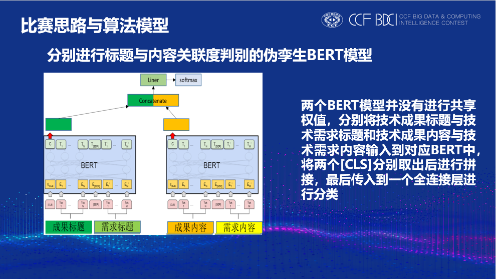
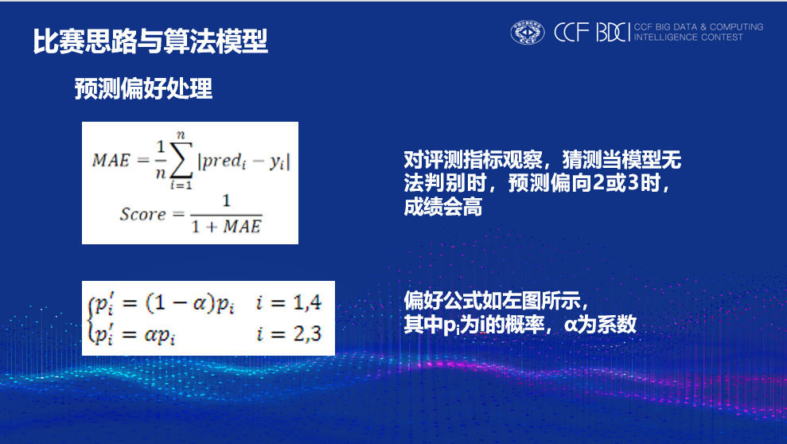
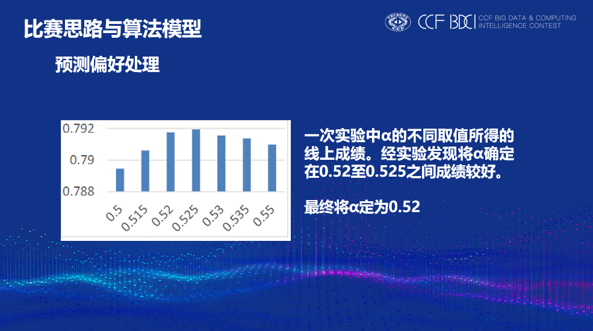

# 2019 CCF BDCI “技术需求”与“技术成果”项目之间关联度计算模型第一名解决方案

## 赛题介绍

赛题介绍见[官方网站](https://www.datafountain.cn/competitions/359)

## 数据预处理

### 数据清洗

对技术成果和技术需求的较短内容进行筛选查看，发现其中存在一定量的空白、“\n”、“未提供。”等无用信息。使用对应标题对无用信息进行替换。

### 数据增广

对问题进一步化简，可以简化成两个文本之间的关联度计算。

1.那么A文本与B文本之间关联度，同样也是B文本与A文本之间关联度。该方法在仅取标题时可以提升成绩。当加入内容时会造成过拟合，最终未采用该方法。

2.那么假设A文本与B文本之间关联度为4，A文本与C文本之间关联度为3，那么可以假定B文本与C文本之间关联度为3，按照这个思路可以假设关联矩阵

其中A文本与B文本之间关联度为i，A文本与C文本之间关联度为j，那么B文本与C文本之间关联度为R_(i,j)。此方法可增加数据295994条，从中按照原数据集各个关联度等级的比例从中随机取出10000条。该方法我认为具有一定的可能性，但由于训练时间过长、提交次数有限，尝试过的参数均会造成过拟合现象。最终模型中未对数据进行数据增广。

### 模型

1.标题与内容拼接的孪生BERT模型

2.分别进行标题与内容关联度判别的孪生BERT模型

3.分别进行标题与内容关联度判别的伪孪生BERT模型

最终只采用这个模型，也没有进行融合。当然可以很简单的认为它就是分别使用两个BERT进行相似度判别然后进行拼接。
其中进行技术成果标题与技术需求标题关联度计算的BERT采用谷歌开源的BERT-base；进行技术成果内容与技术需求内容关联度计算的BERT采用哈工大讯飞联合实验室发布基于全词覆盖的BERT-WWM。该预训练由于采用了全词覆盖，在多数情况下可以取得更好的效果。在第一个进行技术成果标题与技术需求标题关联度计算的BERT中输入最大长度MaxLenT设置为128，两个标题拼接最大长度也没有超过128个字，同时这样可以减少训练时间和显存需求；在第二个进行技术成果内容与技术需求内容关联度计算的BERT-WWM中输入最大长度MaxLenC设置为512，尽可能多的读取数据内容。两个BERT都采用12layers, 768hidden states, 12heads版本，该模型采用7折交叉验证，其中batch size取16，epoch取8，并在训练时保存较好的模型权值，初始学习率设置成5e-5，后续学习率设置成1e-5。

## 预测偏好处理

## 模型对比

|序号   | 模型         | 初赛成绩  |  复赛成绩  | 
|---|-----------------|-----------|-----------|
| 1 | BERT-base       | 0.78585178 |0.79595751|
| 2 | RoBERTa-base    | 0.78077936 |/         |
| 3 | 孪生BERT-1      | 0.78604090 |0.79607499|
| 4 | 孪生BERT-2        | 0.78509617|0.79843128|
| 5 | BERT+数据增广-1   | /          |0.80163449|
| 6 | BERT+数据增广-2   | /          |0.77996242|
| 7 | BERT+数据增广-3   | /          |0.79548806|
| 8 | BERT-T128C512     | 0.79079902 |0.79866767|
| 9 | BERT-WWM-T128C512 | 0.79099053 |0.80008900|
| 10 | 最终模型          | 0.79175758 |0.80642748|

1.其中BERT-base、RoBERTa-base、BERT+数据增广-1、BERT+数据增广-2、BERT+数据增广-3模型中输入均只有技术成果标题与技术需求标题，MaxLenT为128，其余超参数与最终模型中基本相同。

2.孪生BERT-1模型为标题与内容拼接的孪生BERT模型，MaxLen为512，其余超参数与最终模型中基本相同。

3.孪生BERT-2模型为分别进行标题与内容关联度判别的孪生BERT模型，MaxLen为512，其余超参数与最终模型中基本相同。

4.BERT+数据增广-1模型中，数据增广采用第一种方式。

5.BERT+数据增广-2模型中，数据增广采用第二种方式，且取全部增广数据。

6.BERT+数据增广-3模型中，数据增广采用第二种方式，但按照原数据集各个关联度等级的比例从中随机取出。

7.BERT-T128C512模型中BERT均采用谷歌发布的BERT-base，其余超参数与最终模型中相同。

8.BERT-WWM-T128C512模型中BERT均采用采用哈工大讯飞联合实验室发布的BERT-WWM，其余超参数与最终模型中相同。

9.最终模型中标题采用谷歌发布的BERT-base，内容采用哈工大讯飞联合实验室发布的BERT-WWM。

## 总结
我个人认为BERT-WWM预训练相比于BERT预训练对中文效果应该更好，而得到这样的结果，可能的原因是两个预训练在训练时使用的语料库不同，标题部分中专业名词比重较大且短小，BERT对此比较敏感，而BERT-WWM对常规文本比较敏感。当然这个成绩中也有预测偏好处理的功劳。

## 复现
由于版权问题，本项目不提供数据集，可以去DF平台[下载](https://www.datafountain.cn/competitions/359/datasets)。
下载好数据集后可直接运行bash train.sh

## 写在后面的话

### 感谢开源

本次比赛十分感谢华南理工大学Chevalier同学在知乎上分享的[BaseLine](https://zhuanlan.zhihu.com/p/82737301)。本代码修改于该代码。

由于刚开始接触深度学习，也是头一次参加比赛，本人水平有限欢迎批评指正。
